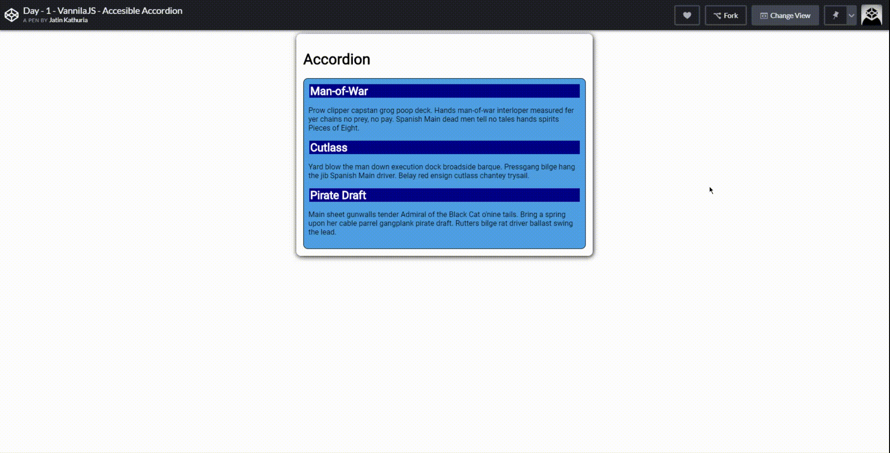
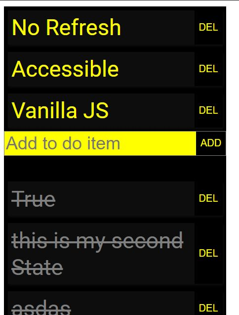

# 30-days-of-Vanilla-JS
This repository has 30 mini project ideas (approx 2 hours each) that I will coding everyday. 

These ideas will not be much about beautification, than about the logic and learning how vanilla JS functions. 

VanillaJs means vanilla JS. I DO NOT use any framework.. not even Jquery, except some fonts like Roboto from google library. In every build I put maximum of 3 hours and whatever I can build. You can try at your end.

Here is the list of Ideas and their links and screenshots.

## 1. Accordion

This is a really good introduction to javscript on how we can dynamically affect the javascript.

Skills Earned:
- CSS
- CSS handling from javascript
- Basic Event Handling

[View Code](./Day1-Accordion)

## 2. Statefull todo App (3 hours)

This is the simplest completed app that everyone must do as it takes maximum of 3 hours if know how language works.  I also needed to some googling.

It came out to be more beautiful than I expected. 

Skills Earned:
- CSS
- Javscript Basic Issues with state management and refreshes
- How to persist state when page is refreshed.
- Basic Event handling
- Basic Accessibility
- Updates without refresh

[View Code](./Day2-Stateful-Todo-App)

## 3. State management System using Vanilla Javascript - (4 hours)

I love React but I want to know how it works. I have tried contributing to React but it takes time to make a pull request in an open source project specially if you need someone else's input.

So, I thought, I will quick build a state management system to see how it works. I know that is not the only thing in react but it works.

I will be trying to do most of things on my own and below are the articles I refered.

Skills Earned:

- Event-driven development
- Componentising HTML
- Javascript Proxies
- Form Submission
- How Pub-Sub works

